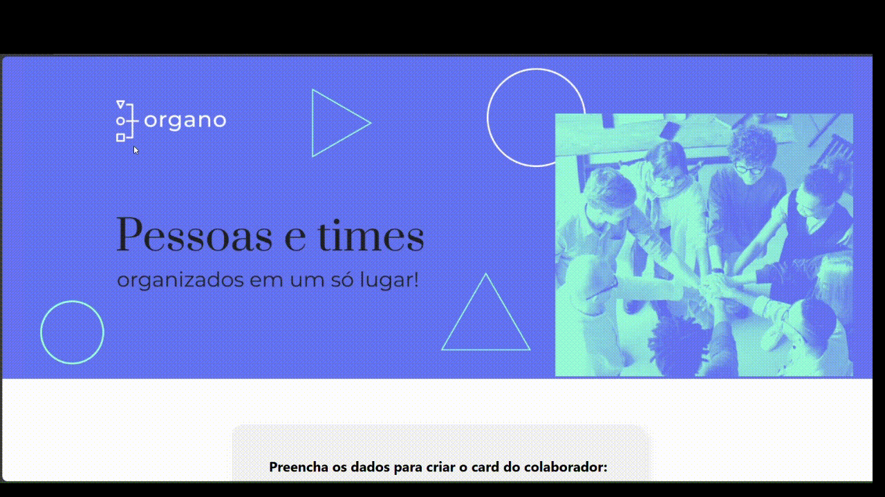

# 🌐 [Organo](organo-alura-react-five.vercel.app/)

Um site desenvolvido com **React** para cadastrar equipes de desenvolvedores.
Cada colaborador é exibido em **cards personalizados**, com cores específicas para cada área e imagem de perfil puxada diretamente do GitHub.

🚀 Foi meu **primeiro projeto com React** e marcou o início da minha jornada com a biblioteca.

---

## 🎥 Preview



---

## 🛠️ Tecnologias


---

## 📌 Funcionalidades

- 📋 Cadastro de colaboradores com **nome, cargo, imagem e time**
- 🎨 Cards com **cores únicas para cada time**
- 🖼️ Suporte a **imagem de perfil do GitHub**
- 🧩 Interface totalmente **responsiva**

---

## 👨‍💻 Como rodar o projeto

```bash

# Clone o repositório
git clone https://github.com/UelintonHJ/organo-alura-react

# Acesse a pasta do projeto
cd ~/organo-alura-react

# Instale as dependências
npm install

# Rode o servidor local
npm start

```
O projeto estará rodando em http://localhost:3000

---

## ✨ Créditos

Projeto desenvolvido nas aulas da [Alura](https://www.alura.com.br/)
